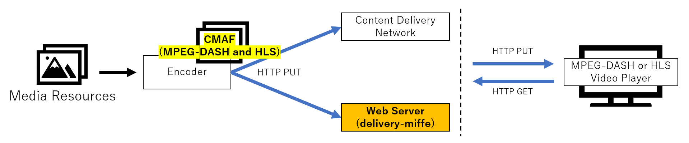

# delivery-miffe

video content streaming server  
[Japanese Document](./README_JP.md)

## Overview

- A distribution server for MPEG-DASH/HLS streaming.
    - Support CMAF (Common Media Application Format : Reference[1]) Ultra low latency(ULL) distribution.



- Reference
    - [1] ISO/IEC23000-19：“Common media application format (CMAF) for segmented media”

## Environment

- python 3.7.x ~ 3.10.x

## Interoperability

This tool (delivery-miffe) has been tested for interoperability with the following OSS.

- Encoder
    - [ffmpeg](https://www.ffmpeg.org/)
    - Videon EdgeCaster
    
- Video Playback Player
    - [dash.js](https://github.com/Dash-Industry-Forum/dash.js)
    - [hls.js](https://github.com/video-dev/hls.js/)
    - [basjoo.js](https://github.com/nhkrd/basjoo.js)

- Media Timed Events(MTE) insertion tool  
    - [relay-miffe](https://github.com/nhkrd/relay-miffe)

## Directory

```
.
├── LICENSE.txt
├── NOTICE.txt
├── README.md
├── content
├── docs
├── test
├── delivery.sh         # start shell
├── deliverymiffe.py
├── input.log           # log file
└── settings.ini        # setting
```

## How to Use

### Startup

- run tools
```
$ ./delivery.sh
($ python3 deliverymiffe.py)
```

IP address and port can be set in [settings.ini].

### Sample

- Input from encoder

If you use ffmpeg, [sample here](./test/ffmpeg_cmaf.sh) can be used to input videos.

- Request from video playback player

Follow the steps below to request a manifest file from a video player.

```
# For MPEG-DASH
http://[IP address of delivery-miffe]:[Port number of delivery-miffe]/[Directory of video content]/manifest.mpd

# For HLS
http://[IP address of delivery-miffe]:[Port number of delivery-miffe]/[Directory of video content]/master.m3u8
```

## Ohters

### API for startup verification

The activation status of this tool can be checked via HTTP GET.

```
# Use Browser
http://[IP address of delivery-miffe]:[Port number of delivery-miffe]/status
```

### Enable/disable HTTP DELETE method

The following item in [settings.ini] can be used to enable or disable the HTTP DELETE method processing.
It is possible to disable file deletion using the DELETE method when delivery from the encoder is stopped, and to store LIVE delivered videos as VOD.

```
FileDelete = True #Enable
```

## License

See [LICENSE.txt](./LICENSE.txt) and [NOTICE.txt](./NOTICE.txt).
